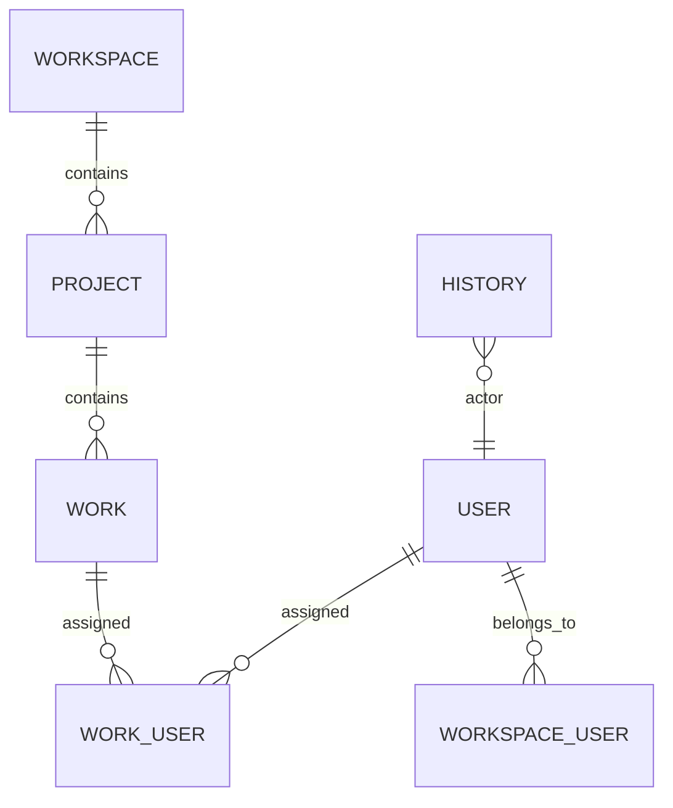

# Arquitectura — Backend (Kestrel)

Última actualización: 2026-05-20

## Resumen ejecutivo

Kestrel es un servicio GraphQL construido con NestJS, Mercurius y Fastify que expone una API para gestionar workspaces, proyectos y works. La persistencia se realiza en PostgreSQL mediante Drizzle ORM. La autenticación utiliza PASETO y existe un sistema de historial para auditoría.

## Diagramas de alto nivel

### Diagrama de sistema

```mermaid
flowchart LR
    Browser[Cliente (Navegador / App móvil)] -->|GraphQL| Frontend[Frontend (Angular / SSR)]
    Frontend -->|GraphQL| API[Backend GraphQL (NestJS + Mercurius)]
    API --> Drizzle[Drizzle ORM]
    Drizzle --> Postgres[(PostgreSQL)]
    API --> Auth[PASETO Auth]
    Auth --> Tokens[Token Service]
    API --> History[History Module]
```

### Diagrama simplificado del dominio (entidades principales)



## Componentes y responsabilidades

- `GraphQLModule` (Mercurius): auto-genera `src/schema.gql` y expone el esquema.
- Módulos por dominio: `users`, `workspaces`, `projects`, `works`, `history`, `tags`, `comments`.
- `DrizzleModule`: proveedor de conexión y mapeo a la base de datos.
- `PasetoModule`: gestión de tokens y validación de autenticación.

## Modelo de datos y decisiones

- Tipos ENUM para `role`, `action`, `state`, `level` permiten validación en la BD.
- `history` almacena registros de cambios con `old_value`/`new_value` para auditoría.
- Índices y claves foráneas definidos en `Schema.sql` para consultas eficientes.

## Seguridad

- Autenticación basada en PASETO; evitar almacenamiento de secretos en el repo (.env usado en producción gestionado por el entorno).
- Las operaciones sensibles deben validar roles y pertenencia a `workspace` antes de mutar recursos.

## Despliegue y operaciones

- `docker-compose.yml` contiene el servicio `postgres` para desarrollo.
- En producción: contenedor del backend con variables de entorno para DB y secretos; usar orquestador (Kubernetes) para escalado.
- Estrategia de migraciones con `drizzle-kit` y scripts basados en `Schema.sql`.

## Observabilidad

- Añadir middleware de logging estructurado (p.ej. pino) y trazas distribuidas (OpenTelemetry) en puntos críticos.

## Casos de uso críticos

- Crear una `work`: mutation GraphQL `createWork`, inserción en `work` y registros en `history`, notificación por subscripción opcional.

## Apéndice: consultas y mutaciones relevantes

- `Query`: `me`, `myWorks`, `workspaceStats`, `projects`
- `Mutation`: `createUser`, `startUser`, `createWork`, `updateWork`, `assignUserToWork`, `createProject`
