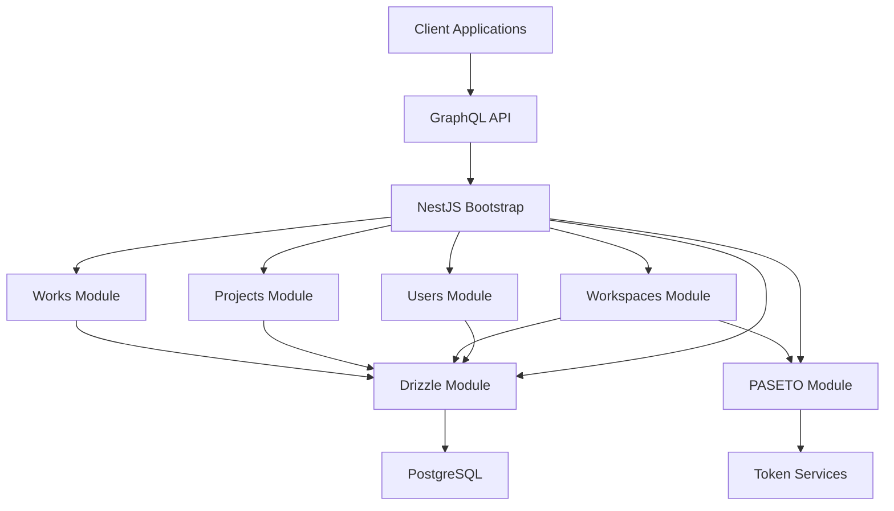
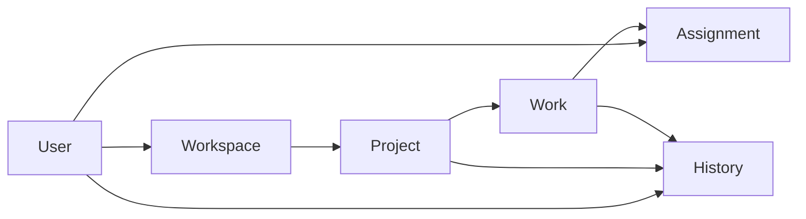

## Kestrel

Kestrel is a NestJS based task management backend built with GraphQL, Mercurius, Fastify, Drizzle ORM, PostgreSQL, and PASETO authentication. It provides a domain driven API for users, workspaces, projects, and works, with shared database access and history tracking handled through the database layer.

## What The Project Does

The application exposes a GraphQL API for managing collaborative work. Users can belong to workspaces, create projects inside workspaces, and manage works inside projects. The database schema also stores assignment and history data so changes can be tracked over time.

## Main Building Blocks

- Application bootstrap in src main
- Global module composition in src app module
- GraphQL API through Mercurius
- Drizzle based data access layer
- PASETO based authentication support
- Domain modules for users, workspaces, projects, and works

## Architecture Graph



## Domain Graph



## Data Model Summary

- Users store identity and profile data such as nickname, email, password, name, lastname, and birthdate.
- Workspaces group people and the work that belongs to them.
- Projects belong to a workspace and keep a description plus creator reference.
- Works belong to a project and carry state and priority information.
- Workspace and work assignment tables connect users to collaborative entities.
- History records capture actions, affected entities, and field changes.

## Technologies

- NestJS
- GraphQL
- Mercurius
- Fastify
- Drizzle ORM
- PostgreSQL
- PASETO

## Available Scripts

- npm run start starts the application in development mode
- npm run start:dev starts the application with watch mode
- npm run start:prod starts the compiled application
- npm run test runs unit tests
- npm run test:e2e runs end to end tests
- npm run test:cov runs test coverage
- npm run build compiles the project

## Setup

```bash
npm install
```
## Author 
#### Daniel Eduardo Useche
